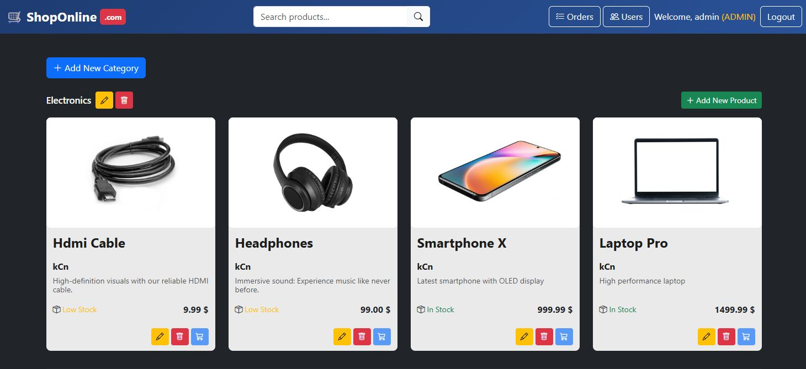
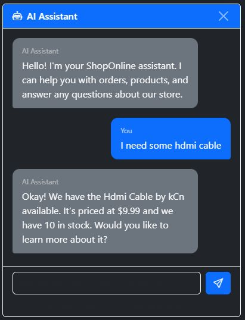
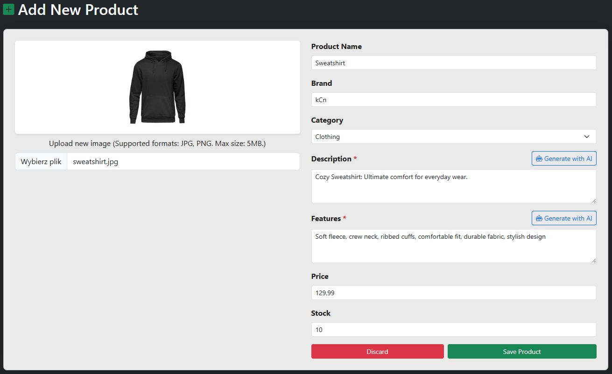

<p align="center"></p>


## 🛒 E-Shop - AI-Powered E-Commerce Platform

An end‑to‑end sample e‑commerce web application built with Spring Boot. 
It includes user authentication, product catalog, cart and checkout flows, order management, server‑side rendered pages (Thymeleaf), and static assets. 
The app ships with database schema and seed data for quick local development.
---
## 📋 Table of Contents

- [Features](#-features)
- [AI Features](#-ai-features)
    - [AI Chat Assistant](#-ai-chat-assistant)
    - [Vector-Based Product Search](#-vector-based-product-search)
    - [AI-Generated Product Content](#-ai-generated-product-content)
- [Tech Stack](#️-tech-stack)
- [Prerequisites](#-prerequisites)
- [Installation](#-installation)
- [Configuration](#️-configuration)
- [Useful Endpoints](#-useful-endpoints)
- [Project Layout](#-project-layout)
- [Troubleshooting](#troubleshooting)
- [License](#-license)

---
<p align="center"></p>

## ✨ Features
- 🛍️ **Products and categories**: browse, view, and manage products
- 🛒 **Cart and checkout**: add to cart, place orders, order confirmation
- 👤 **User accounts**: registration, login, and profile orders page
- 🔐 **Admin pages**: manage users, orders, and products
- 📸 **File uploads**: product images saved under `uploads/products`
---
<p align="center">
  
  
</p>

## 🤖 AI Features
### 🟦 AI Chat Assistant

#### The application includes an intelligent chat assistant powered by Ollama that:
- Provides context-aware responses based on user order history
- Performs semantic product search using vector embeddings
- Assists with product inquiries and recommendations
- Maintains conversation context and user session information

### 🟦 Vector-Based Product Search
#### Products are automatically embedded using AI and stored in PostgreSQL with pgvector for semantic search:
- Natural language product queries
- Similar product recommendations
- Category-aware search results

### 🟦 AI-Generated Product Content
#### Administrators can use AI to generate:
- Product descriptions
- Feature lists
---

## 🛠️ Tech stack
### Backend
- **Spring Boot 3.x** - Core framework
- **Spring AI** - AI integration and vector store
- **Spring Security** - Authentication and authorization
- **Spring Data JPA** - Database access
- **PostgreSQL** - Relational database with pgvector extension
- **Ollama** - Local LLM inference

### Frontend
- **Thymeleaf** - Server-side templating
- **Bootstrap** - UI framework
- **JavaScript** - Client-side interactivity

### Additional Libraries
- **Lombok** - Boilerplate reduction
- **MapStruct** - Object mapping
- **Logback** - Logging

---

## 📦 Prerequisites

Before running this application, ensure you have:

1. **Java 24** or higher
2. **Maven 3.8+**
3. **PostgreSQL 14+** with pgvector extension
4. **Ollama** installed and running locally

### 🛢 Database and seed data

For local development, the app can initialize schema and seed rows from:

- `src/main/resources/db/schema.sql`
- `src/main/resources/db/data.sql`

Adjust `spring.sql.init.*` and `spring.datasource.*` settings in `application.yml` if you change your DB.


---
## 🚀 Installation
1. Clone the repository and navigate to the project directory
``` bash
   git clone <repository-url>
   cd e-shop
```
2. Configure environment variables. Create a `.env` file in the e-shop directory as shown below.
3. Build the project
``` bash
./mvnw clean install
```
4. Running the Application
   
Using Maven
``` bash
./mvnw spring-boot:run
```
Using JAR
``` bash
java -jar target/e-shop-*.jar
```
The app starts on `http://localhost:8080` by default.

### ⚙️ Configuration
Create a `.env` file in the e-shop directory with the following variables:
``` env
# PostgreSQL Configuration
POSTGRES_URL=localhost          # Your PostgreSQL server host
POSTGRES_DB=shop                # Name of DB
POSTGRES_USER=myuser            # username
POSTGRES_PASSWORD=mypassword    # Password

# Ollama Configuration
OLLAMA_URL=http://127.0.0.1:11434   # Local Ollama API endpoint
TOP_K=1                             # Number of similar products to return in vector search

# Admin Credentials
ADMIN_USERNAME=admin            # Username for admin account
ADMIN_PASSWORD=123              # Admin password
```
---

## 🔌 Useful endpoints

The application exposes typical e‑commerce routes via MVC controllers. A few examples you can explore in a browser:

- `GET /` — home page
- `GET /product/{id}` — product details
- `GET /cart` — view cart
- `POST /cart/add` — add to cart
- `GET /orders` — user orders
- `GET /admin/users` — admin users page
- `GET /admin/orders` — admin orders page

---

## 📁 Project layout

Key paths in this repo:
```
e-shop/
├── src/
│   ├── main/
│   │   ├── java/com/kcn/e_shop/
│   │   │   ├── config/          # Configuration classes
│   │   │   ├── controller/      # REST and MVC controllers
│   │   │   ├── dto/             # Data Transfer Objects
│   │   │   ├── entity/          # JPA entities
│   │   │   ├── mapper/          # MapStruct mappers
│   │   │   ├── repository/      # Spring Data repositories
│   │   │   ├── security/        # Security configuration
│   │   │   └── service/         # Business logic
│   │   └── resources/
│   │       ├── static/          # CSS, JS, images
│   │       ├── templates/       # Thymeleaf templates
│   │       └── application.yml  # Application configuration
│   └── test/                    # Unit and integration tests
├── uploads/                     # Product image storage
├── .env                         # Environment variables
├── pom.xml                      # Maven dependencies
└── README.md                    # This filee-shop/
```

---

## 🐛Troubleshooting

- Port already in use → set `server.port` to a free port.
- Database connection issues → verify `spring.datasource.*` and driver on classpath.
- Static assets not updating → clear browser cache or disable caching in dev tools.
- File upload failures → check write permissions for `uploads/products/`.

---

## 📜 License
This project is available under the MIT License. You are free to use, modify, and distribute it according to the license terms.


